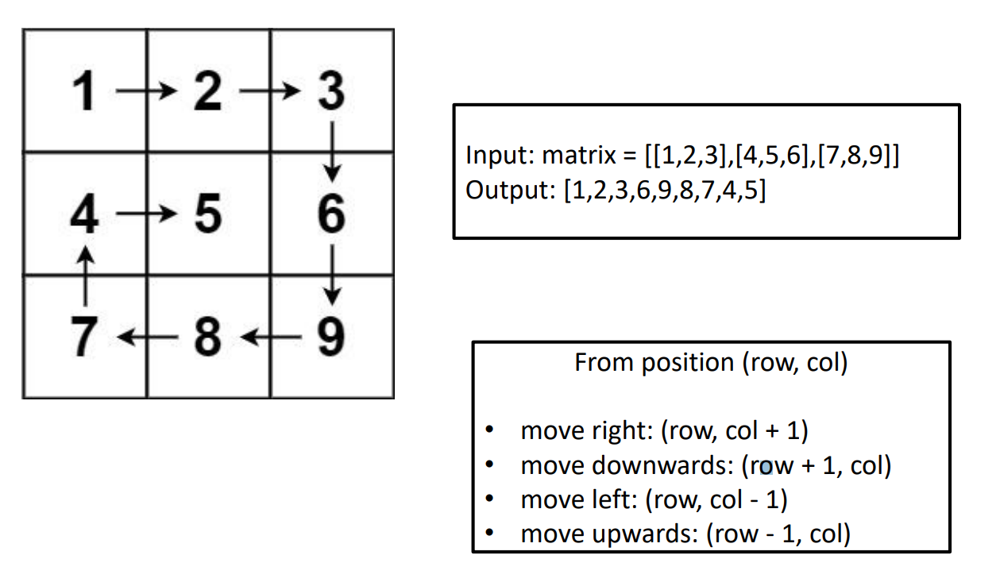

## Assignment 13 -   Strings, List and Array Problems (Spiral Matrix) in Python

### Loic Konan

### Description

**Spiral Matrix Problem in Python**  
***List**
### Instructions

> - First, 4 variables containing the indices for the corner points of the array are initialized. 
> - The algorithm starts from the top left corner of the array, and traverses the first row from left to right. Once it traverses the whole row it does not need to revisit it, thus, it increments the top corner index.
> Once complete, it traverses the rightmost column top to bottom. Again, once this 
> completes, there is no need to revisit the rightmost column, thus, it decrements the right corner index. 
> - Next, the algorithm traverses the bottommost row and decrements the bottom corner index afterward. 
> - Lastly, the algorithm traverses the leftmost column, incrementing the left corner index once it’s done. 
> This continues until the left index is **greater** than the right index, and the top 
> index is **greater** than the bottom index.
> 
> - **Lists** are just like dynamic sized arrays, declared in other languages (vector in C++ and ArrayList in Java).
> - **Lists** need not be homogeneous always which makes it a most powerful tool in Python.
> - **A single list may contain DataTypes like Integers, Strings, as well as Objects.**
> - **Lists are mutable, and hence, they can be altered even after their creation.**
>
### Files

|   #   | File                                   | Description |
| :---: | -------------------------------------- | ----------- |
|   1   | [main.py](main.py)                     | Solution    |
|   2   | [spiral_mattrix.py](spiral_mattrix.py) | Solution    |

