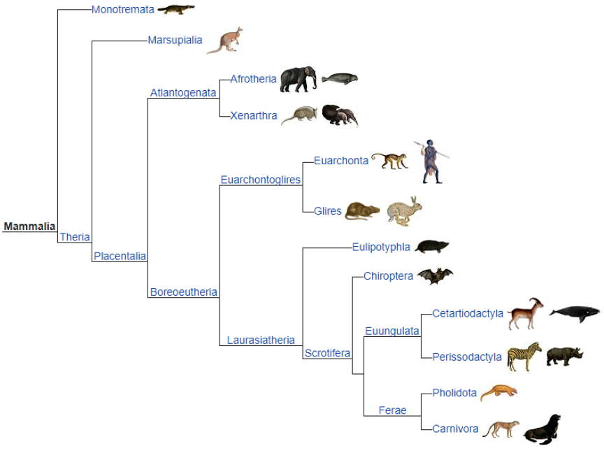

## Assignment Question 02 - Mammalia family

### Loic Konan

#### Description

**2.** Consider the following organigram (<https://en.wikipedia.org/wiki/Mammal>) of **Mammalia family**.(a: 5, b: 5, c: 10, d: 20, e:10)
> 
>
> - **a.** Each of members:
>   - **i.** has:
>
>       1. **Legs (count)**
>       2. **Tails (yes/no)**
>       3. **Brain (yes/no)**
>       4. **Neurons (count)**
>       5. **Precision to understand (0.00 to 100.00%)**
>       6. **Birth date**
>       7. **Favorite foods**
>
>   - **ii.** can:
>
>       1. **Eat**
>       2. **Walk**
>       3. **Sleep**
>       4. **Give Birth**
>
> - **b.** Think about perissodactyla, they can mate with carnivora members;
>   - can breed and produce a new family called **‘Perivora’**.
>   - Perivora animals supposed to give birth to a new family **‘Periveron’**.
>   - But by nature law **no periveron member can be created**.
>
> - **c.** Create at **least 5 animals from each family**;
>   - **Perviveron member cannot be produced**.
>
> - **d.** Now you can do some creativity:
>   - by changing the **neurons, precision to understand, food habits**.
>   - but you can’t change the **legs, brains, birth date**.
>   - Change these features for at **least 20 animals** and **show how it was before and how it is now**.
>
>   From level 6 to 8(Considering Mammlia as level-1 and carnivora, cetartiodactyla are on level-8),animals can run and hunt for their food.
>   - Change at **least 10 animals’ running speed, hunting process and hunting food type for those who are 6-8 level animals.**
>   - Try changing **at least 10 animals and show (reading from files; see next bullet) what they were and what they are now.**
>
> - e.
>   - All outcomes should be **stored in a file**.
>   - When you have created objects, their information should be **stored in files**.
>   - After changing their behaviors and attributes, they should also be **stored in files**.
>   - The term show mentioned in the previous sub-section refers to **reading the data from files and printing to the console**.
>

### Files

|   #   | File                               | Description |
| :---: | ---------------------------------- | ----------- |
|   1   | [Question_2.java](Question_2.java) | Solution    |
|   2   | [Outfile.txt](Outfile.txt)         | Outfile     |

### Instructions

- Complied using **VScode** and **Java @version SE9**
