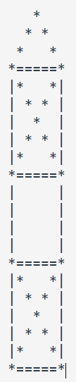

## Assignment Question 01 - Three-Stage Rocket

### Loic Konan

#### Description

> **1.**
>
> - Write a Python program to draw a **three-stage rocket**.
>   - **Example:**  
>           
>
>
### Files

|   #   | File                         | Description |
| :---: | ---------------------------- | ----------- |
|   1   | [Question1.py](Question1.py) | Solution    |

### Instructions

- Complied using **VScode** and **Python 3.9.2**
