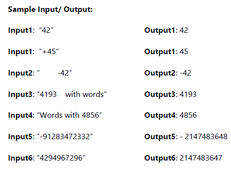

## Program 03 - Problem solving in Python

### Loic Konan

### Description

> **1.**
>
> - Write a Python program to draw a **three-stage rocket**.
>   - **Example:**  
>           
>
>
> **2.**
>
> - Write a program where it asks to enter the **number of people**, then based on this number
> - _iterate that amount of time_ where each time get _single person’s information_:
>   - **First Name**
>   - **Last Name**
>   - **Age**
>   - **Occupation**
>   - **Address.**
>
> - Make sure you **validate all users’ input**.
> - Included but not limited to like age cannot be a non-numeric value should be between 0-150,
> - name can only be **non-numeric**.
> - Finally **show (print) user details one by one**.
> - For your input validation, make sure you **can’t proceed next step/value without inserting valid input on current phase**.
>
>   - **Example:**
>
>       
>
>
> **3.**
>
> - Implement the **myAtoi(string s) function**, which converts a **string to a 32-bit signed integer**.
> - The algorithm for myAtoi(string s) is as follows:
>   - a) Read in and **ignore any leading whitespace**.
>   - b) Check if the next character (if not already at the end of the string) is **'-' or '+'**.
>     - Read this character in if it is **either**.
>     - This determines if the **final result is negative or positive respectively**.
>     - Assume the result is **positive if neither is present**.
>   - c) Read in next the characters until the next non-digit character or the end of the input is reached.
>     - The rest of **the string is ignored**.
>   - d) Convert these digits into an integer **(i.e. "123" -> 123, "0032" -> 32)**.
>     - If no digits were read, then the integer is 0. Change the sign as necessary (from step 2).
>   - e) If the integer is out of the 32-bit signed integer **range [-2^31, 2^31 - 1], then clamp the integer so that it remains in the range**.
>     - Specifically, **integers less than -2^31 should be clamped to -2^31, and integers greater than 2^31 - 1 should be clamped to 2^31 - 1**.
>   - f) **Return the integer as the final result**.
>
> - **Note**:
>   - Only the space character **' '** is considered a whitespace character.
>   - **Do not ignore** any characters other than the leading whitespace or the rest of the string after the digits.
>
> - **Example:**
>
>   
>
>
### Files

|   #   | File                     | Description  |
| :---: | ------------------------ | ------------ |
|   1   | [Question1](./Question1) | **Solution** |
|   2   | [Question2](./Question2) | **Solution** |
|   3   | [Question3](./Question3) | **Solution** |
