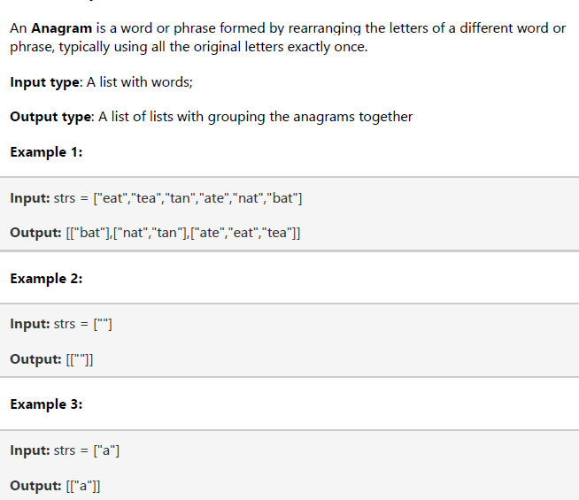

## Program 04 - Problem solving in Python

### Loic Konan

### Description

> **1.**
>
> - Write a Python program using file operation.
> You will open an input file “students.dat” that will contain a list of student names, classification, and grade in the class.
> You should read through the entire input file.
> After reading in all information, do operations (No built-in functions like Average, min, max, count, etc.), close the input file and write that following information with labels to an output file "student_statistics.txt"
> Highest grade in the class
> - Lowest grade in the class
> - Class average grade (rounded to one decimal place)
> - Number of freshmen students
> - Number of sophomore students
> - Number of junior students
> - Number of senior students
>
> Sample contents inside the input file “Students.dat”; each of the following refers to a single line, i.e.; 6 lines in our input file:
>
> - Holly Berry freshman 88
> - Red Johnson sophomore 74
> - Jeff Bozo freshman 91
> - Pebble Johnston senior 82
> - Thomas BradyBunch freshman 63
> - Eddy Sheen junior 97
>
> Sample content inside the output file “student_statistics.txt”:
>
> - Eddy Sheen
> - Highest grade: 97
> - Lowest grade: 63
> - Class average: 82.5
> - Freshmen: 3
> - Sophomores: 1
> - Juniors: 1
> - Seniors: 1
>
>
> **2.**
>
> - Given an array of strings strs, group the anagrams together. You can return the answer in any order.
> - An Anagram is a word or phrase formed by rearranging the letters of a different word or
> - phrase, typically using all the original letters exactly once.
>
> **Note:** **You cannot use any built-in functions**.
>
> - You can have only **string, tuples, dictionaries to solve this problem**.
> - **Example:**
>   
>
>
> **3.**
>
> Write the OOP program in python using class. Assuming you have **four classes**:
>
> - **Bank account** which is the parent class and it has two child classes Saving
> - **Account class** and Checking account class. Customer is another class who has a bank
> - **account**; either saving or checking or both. Implement the scenario using python OOP
> - Make sure you have covered those OOP concepts on your code:
>   - **Inheritance(any)**
>   - **Polymorphism (runtime and compile time)**
>   - **Abstraction**
>   - **Encapsulation**
>
>
### Files

|   #   | File                     | Description  |
| :---: | ------------------------ | ------------ |
|   1   | [Question1](./Question1) | **Solution** |
|   2   | [Question2](./Question2) | **Solution** |
|   3   | [Question3](./Question3) | **Solution** |
