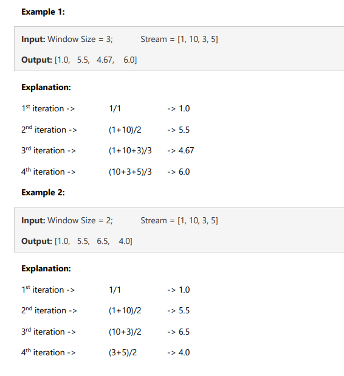

## Assignment Question 03 -  Queue and or Stack data structure

### Loic Konan

#### Description

>
>
> **3.**
>
> - Write a python code to find the **average from a stream**.
> - The input of this program will receive a **stream of numbers** and a **window size**
> - to find the moving average of all the numbers in the sliding window.
> 
> - Write your code in _**OOP style and solve the program with queue and or stack data structure**_.
>
>
> - **Input type:** Window Size as integer and a stream contains numbers as list;
> - **Output type:** A list of float values denoting the moving averages
>
>
>   
>
>
### Files

|   #   | File                         | Description |
| :---: | ---------------------------- | ----------- |
|   1   | [Question3.py](Question3.py) | Solution    |

### Instructions

- Complied using **VScode** and **Python 3.9.2**
