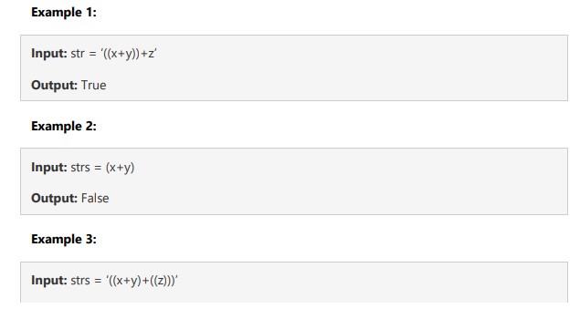

## Program 05 - Problem solving in Python

### Loic Konan

### Description

>
> **1.**
>
> - A stack data structure has following functionalities:
>   - **empty()**
>   - **size()**
>   - **top()**
>   - **push()**
>   - **pop()**
>
> - _**Note:**_
>   - **You need to implement the stack with a Linkedlist data structure in python**.
>   - **Include all of the stack functionalities and constructor**
>
> **2.**
>
> - Given the expression as string **str**, find the **duplicate parenthesis** from the expression.
> - Your program will **output** whether or not finding the duplicates, that is **True or False**
>
> - Example:
>   - **Input type**: An expression in string;          **Output type**: A boolean value **True or False**
>
>   
>
>
> **3.**
>
> - Write a python code to find the **average from a stream**.
> - The input of this program will receive a **stream of numbers** and a **window size**
> - to find the moving average of all the numbers in the sliding window.
> 
> - Write your code in _**OOP style and solve the program with queue and or stack data structure**_.
>
>
> - **Input type:** Window Size as integer and a stream contains numbers as list;
> - **Output type:** A list of float values denoting the moving averages
>
>
>   
>
>
### Files

|   #   | File                     | Description  |
| :---: | ------------------------ | ------------ |
|   1   | [Question1](./Question1) | **Solution** |
|   2   | [Question2](./Question2) | **Solution** |
|   3   | [Question3](./Question3) | **Solution** |
